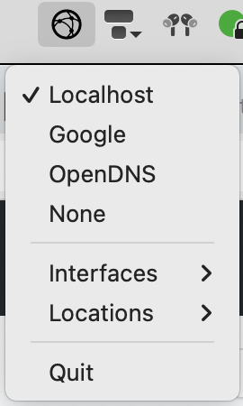

# Introduction

This is a very small toolbar menu for changing your DNS in OSX 13+

It's modified for my needs from the [original](https://github.com/damln/dns.app).

Full credit to [Damián Le Nouaille](https://github.com/damln) for the original app/code and concept!

## Build

`make alias` - dev build

`make app` - App build
 
